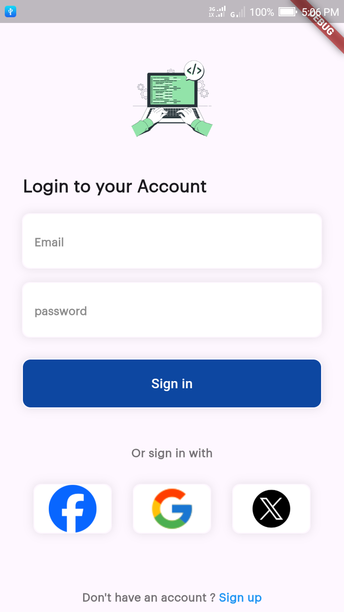
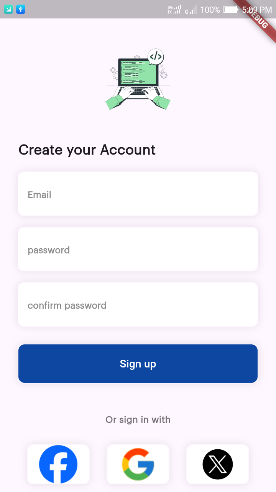
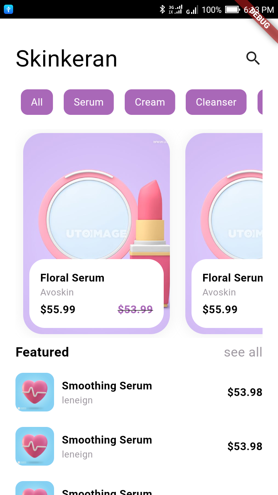
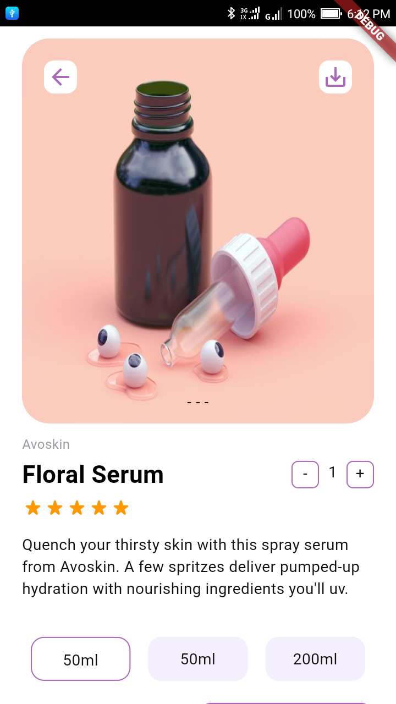

# ui_flutter_app

A new Flutter project.

## Getting Started

This project is a starting point for a Flutter application.

A few resources to get you started if this is your first Flutter project:

- [Lab: Write your first Flutter app](https://docs.flutter.dev/get-started/codelab)
- [Cookbook: Useful Flutter samples](https://docs.flutter.dev/cookbook)

For help getting started with Flutter development, view the
[online documentation](https://docs.flutter.dev/), which offers tutorials,
samples, guidance on mobile development, and a full API reference.

## 📱 Flutter UI Templates – تصاميم واجهات باستخدام Flutter

مرحبًا!  
هذا المستودع يحتوي على مجموعة من مجلدات مشاريع واجهات مستخدم (UI) مصممة باستخدام **Flutter**، حيث يحتوي كل مجلد على تصميم مختلف وفريد يمكن استخدامه كنموذج أولي لتطبيقات متنوعة.

---

### 📁 هيكل المستودع

```plaintext
├── ui_1_login_and_splash/
│   ├── assets/
│   ├── views/
│   └── preview.png
│
├── ui_2_skinkeran/
│   ├── assets/
│   ├── screen/
│   ├── widget/
│   └── preview.png
│
│
└── README.md
```

|------------------|------------------------------|--------------------------------------------|

| التصميم          | الوصف                        | المعاينة                                  |
|------------------|------------------------------|--------------------------------------------|
| `login_ui`       | تصميم شاشة تسجيل دخول أنيقة |  |
| `login_up_ui`    | تصميم شاشة إنشاء حساب       |  |

|------------------|-----------------------------------------------------|--------------------------------------------|
| `Home Skinkeran`       | UI Home  |  |
| `Product Skinkeran`    | تصميم شاشة إنشاء حساب       |  |

|------------------|-----------------------------------------------------|--------------------------------------------|

